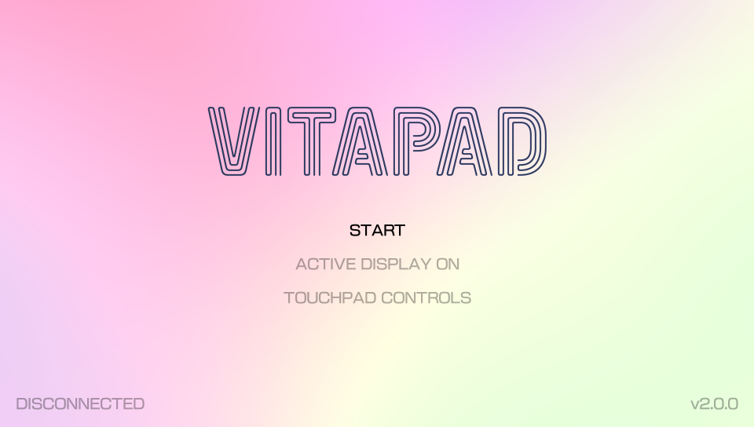
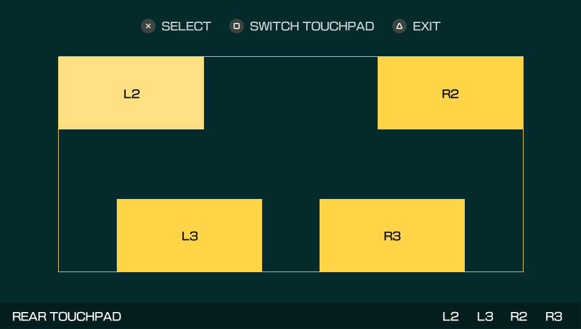

# 🎮 VitaPad
Use your PlayStation Vita as USB gamepad with rear touchpad controls.

## Features
This is an improved version of the [vitastick plugin by xerpi](https://github.com/xerpi/vitastick) with added functionality, improved code readability, and some major changes that increase reliability and usability.
- Simple and elegant interface
- Ability to use rear touchpad controls (L2/R2 & L3/R3)
- Reduces clock frequencies when active to reduce power consumption
- Disables use of power and PS buttons while gamepad functionality is active (this allows the gamepad to continue working as necessary)
- Automatically disconnects after 2 minutes of inactivity

## 🚀 Installation
1. Download the plugin and VPK from the [releases page](https://github.com/carlelieser/vitapad/releases).
2. Copy `vitapad.skprx` to `ur0:/tai/`.
3. Add `vitapad.skprx` to your `config.txt` under the kernel section. 
    ```
    *KERNEL
    ur0:tai/vitapad.skprx
    ```
4. Install `vitapad.vpk`.

## 🐈 Usage
Open the VPK and connect your Vita via USB. Press X to initialize the gamepad functionality. Hold SELECT + START to disconnect. Enjoy!

## Screenshots
<div style="width: 100%;">
   
   
   
</div>